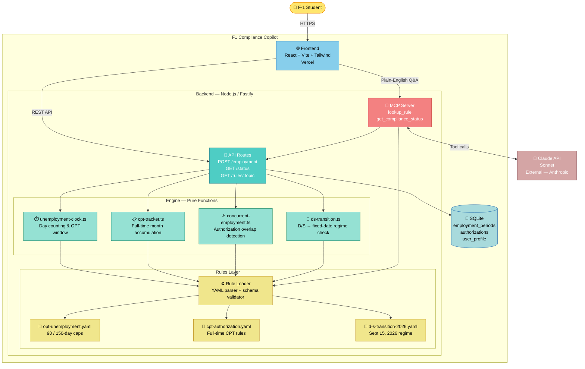
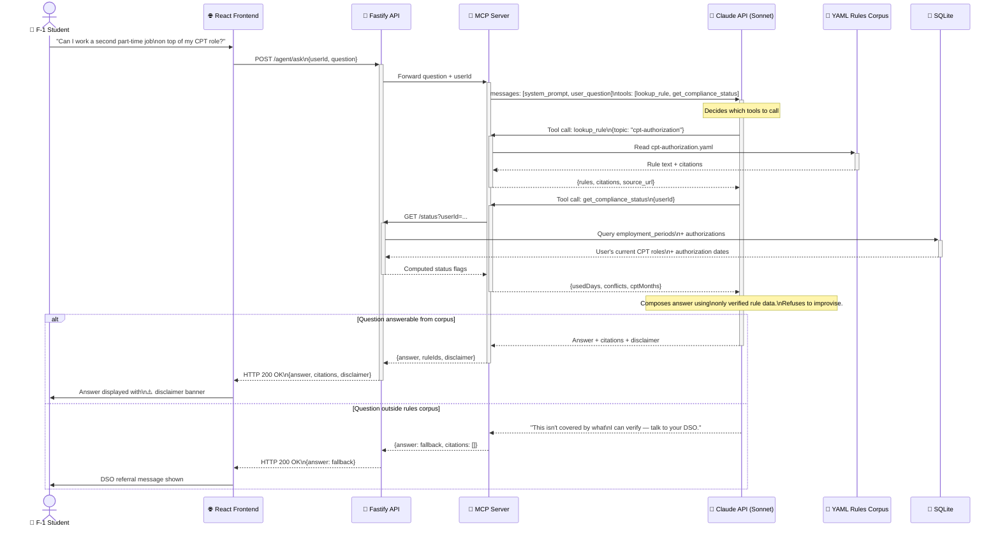

# F1 Compliance Copilot — System Diagrams

## Architecture — C4 Container View

```mermaid
graph TB
    User([👤 F-1 Student])

    subgraph "F1 Compliance Copilot"
        direction TB

        Frontend[🌐 Frontend\nReact + Vite + Tailwind\nVercel]

        subgraph "Backend — Node.js / Fastify"
            APIRoutes[🚪 API Routes\nPOST /employment\nGET /status\nGET /rules/:topic]

            subgraph "Engine — Pure Functions"
                UnemployClock[⏱️ unemployment-clock.ts\nDay counting & OPT window]
                CptTracker[📋 cpt-tracker.ts\nFull-time month accumulation]
                ConcurrentEmp[⚠️ concurrent-employment.ts\nAuthorization overlap detection]
                DsTransition[📅 ds-transition.ts\nD/S → fixed-date regime check]
            end

            subgraph "Rules Layer"
                RuleLoader[⚙️ Rule Loader\nYAML parser + schema validator]
                OptYaml[📄 opt-unemployment.yaml\n90 / 150-day caps]
                CptYaml[📄 cpt-authorization.yaml\nFull-time CPT rules]
                DsYaml[📄 d-s-transition-2026.yaml\nSept 15, 2026 regime]
            end

            MCPServer[🔌 MCP Server\nlookup_rule\nget_compliance_status]
        end

        DB[(💾 SQLite\nemployment_periods\nauthorizations\nuser_profile)]
    end

    ClaudeAPI[🤖 Claude API\nSonnet\nExternal — Anthropic]

    User -->|HTTPS| Frontend
    Frontend -->|REST API| APIRoutes
    APIRoutes --> UnemployClock
    APIRoutes --> CptTracker
    APIRoutes --> ConcurrentEmp
    APIRoutes --> DsTransition
    APIRoutes --> DB

    UnemployClock --> RuleLoader
    CptTracker --> RuleLoader
    ConcurrentEmp --> RuleLoader
    DsTransition --> RuleLoader

    RuleLoader --> OptYaml
    RuleLoader --> CptYaml
    RuleLoader --> DsYaml

    MCPServer --> RuleLoader
    MCPServer --> APIRoutes

    Frontend -->|Plain-English Q&A| MCPServer
    MCPServer <-->|Tool calls| ClaudeAPI

    classDef user fill:#FFE66D,stroke:#F08C00,color:#000
    classDef frontend fill:#87CEEB,stroke:#1864AB,color:#000
    classDef api fill:#4ECDC4,stroke:#0B7285,color:#fff
    classDef engine fill:#95E1D3,stroke:#087F5B,color:#000
    classDef rules fill:#F0E68C,stroke:#B8860B,color:#000
    classDef mcp fill:#F38181,stroke:#C92A2A,color:#fff
    classDef db fill:#A8DADC,stroke:#1864AB,color:#000
    classDef external fill:#D4A5A5,stroke:#7D4E57,color:#fff

    class User user
    class Frontend frontend
    class APIRoutes api
    class UnemployClock,CptTracker,ConcurrentEmp,DsTransition engine
    class RuleLoader,OptYaml,CptYaml,DsYaml rules
    class MCPServer mcp
    class DB db
    class ClaudeAPI external
```

---

## MCP Agent Layer — Sequence Diagram

```mermaid
sequenceDiagram
    actor User as 👤 F-1 Student
    participant UI as 🌐 React Frontend
    participant API as 🚪 Fastify API
    participant MCP as 🔌 MCP Server
    participant Claude as 🤖 Claude API (Sonnet)
    participant Rules as 📄 YAML Rules Corpus
    participant DB as 💾 SQLite

    User->>UI: "Can I work a second part-time job\non top of my CPT role?"

    UI->>+API: POST /agent/ask\n{userId, question}

    API->>+MCP: Forward question + userId

    MCP->>+Claude: messages: [system_prompt, user_question]\ntools: [lookup_rule, get_compliance_status]

    Note over Claude: Decides which tools to call

    Claude->>+MCP: Tool call: lookup_rule\n{topic: "cpt-authorization"}
    MCP->>+Rules: Read cpt-authorization.yaml
    Rules-->>-MCP: Rule text + citations
    MCP-->>-Claude: {rules, citations, source_url}

    Claude->>+MCP: Tool call: get_compliance_status\n{userId}
    MCP->>+API: GET /status?userId=...
    API->>+DB: Query employment_periods\n+ authorizations
    DB-->>-API: User's current CPT roles\n+ authorization dates
    API-->>-MCP: Computed status flags
    MCP-->>-Claude: {usedDays, conflicts, cptMonths}

    Note over Claude: Composes answer using\nonly verified rule data.\nRefuses to improvise.

    alt Question answerable from corpus
        Claude-->>-MCP: Answer + citations + disclaimer
        MCP-->>-API: {answer, ruleIds, disclaimer}
        API-->>-UI: HTTP 200 OK\n{answer, citations, disclaimer}
        UI->>User: Answer displayed with\n⚠️ disclaimer banner
    else Question outside rules corpus
        Claude-->>MCP: "This isn't covered by what\nI can verify — talk to your DSO."
        MCP-->>API: {answer: fallback, citations: []}
        API-->>UI: HTTP 200 OK\n{answer: fallback}
        UI->>User: DSO referral message shown
    end
```
